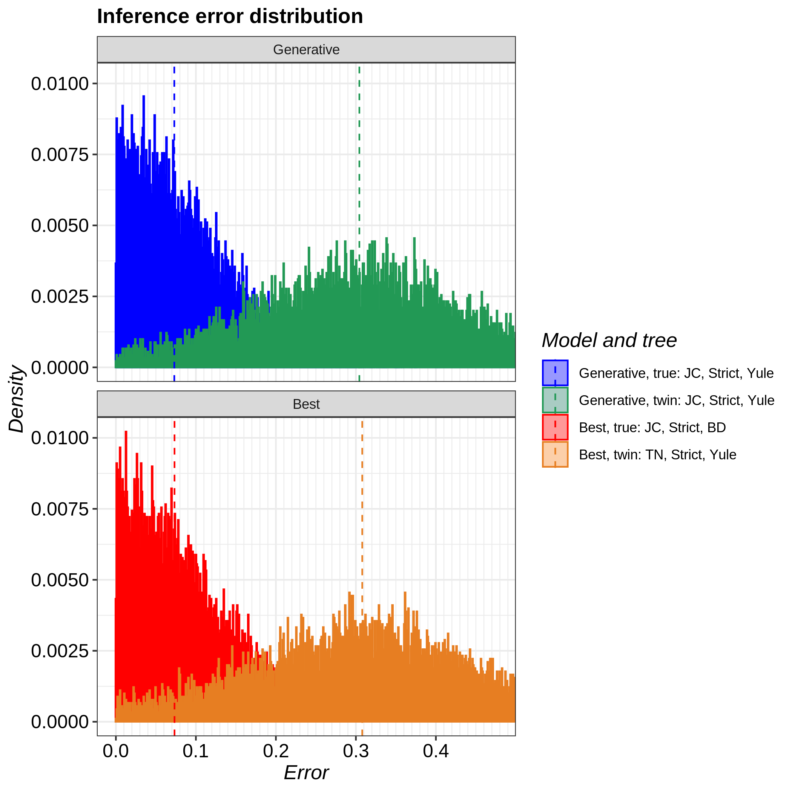

# pirouette_example_28

Branch   |
---------|--------------------------------------------------------------------------------------------------------------------------------------------------------------
`master` |
`develop`|

A [pirouette example](https://github.com/richelbilderbeek/pirouette_examples)
that shows the pirouette plot for multiple DD trees.

This figure is to be used for the pirouette article.

## Related settings

 * [One exemplary DD tree](https://github.com/richelbilderbeek/pirouette_example_30)

## Run-times

n_taxa|chain_length|wallclock_time (mins, ceil)|wallclock_time (hours)
------|------------|---------------------------|----------------------------
4     | 3k         |5                          |0.08
40    | 10M        |158                        |2.6

## Results

